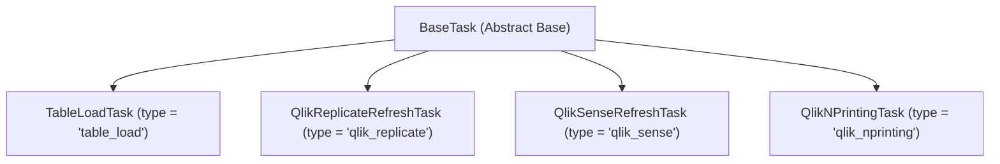

# Production PySpark Metadata-Driven ETL Framework for Apache Iceberg on CDP

[](https://spark.apache.org/)
[](https://iceberg.apache.org/)
[](https://www.cloudera.com/)
[](https://streamlit.io/)
[](https://www.python.org/)
[](tests/)

A production-grade, enterprise metadata-driven ETL and task orchestration framework built with **Python**, **PySpark 3.x**, and **Apache Iceberg**, engineered for high-throughput execution on **Cloudera Data Platform (CDP)** using **TOML configuration files**.

---

## 📌 Project Overview

This framework automates and standardizes high-volume enterprise data ingestion from **Oracle Database**, **Microsoft SQL Server**, **MySQL Database**, **PostgreSQL Database**, and **SFTP File Shares (CSV / Excel)** into **Apache Iceberg** target tables cataloged directly in **CDP Hive Metastore**, as well as triggering external **Qlik Replicate**, **Qlik Sense**, and **Qlik NPrinting** data replication and reporting tasks.

Instead of writing custom PySpark scripts for every pipeline, this framework is **100% metadata-driven and task-centric**. Onboarding a new database table, file feed, or Qlik task requires **zero code changes**—simply define a single `.toml` task configuration file in `config/tasks/` or build composite job pipelines visually in `config/jobs/`.

---

## 🔥 Key Features & Recent Enhancements

- **🎨 Pure HTML5 SVG Visual Canvas Builder**: Interactive canvas using pure SVG element dragging (`mousedown`/`mousemove`/`mouseup`) for unconstrained 4-direction (Left/Right/Up/Down) movement inside Streamlit iframes.
- **🔗 Auto-Updating Dependency Arrows**: Dropdown parent selection automatically updates the visual flow canvas with smooth, animated cubic Bezier connection arrows labeled with `parent ➔ child` relationships.
- **⏳ Real-Time Live Execution State Tracking**: Visual DAG cards update live during Spotify Luigi pipeline runs:
  - **`⏳ RUNNING...`**: Glowing **Amber/Gold** border (`#f59e0b`) & dark amber background with real-time `running_jobs/YYYYMMDD/<task_id>.running` marker tracking.
  - **`✅ SUCCESS`**: Glowing **Emerald Green** border (`#22c55e`) upon successful completion.
  - **`🚨 FAILED`**: Glowing **Crimson Red** border (`#ef4444`) with error audit logging.
- **💼 Composite Job Workflow Engine (`config/jobs/*.toml`)**: Compose multiple reusable task files into a single enterprise job pipeline with custom execution rules and dependencies.
- **📱 Clean Streamlined Enterprise Web UI**: Refined UI featuring left-aligned sidebar navigation, centered action buttons, top-to-bottom logical page hierarchy, and zero clutter.

---

## 🕸️ How to Create a Multi-Task Pipeline DAG (Luigi Orchestration)

In this framework, a **Job Pipeline (DAG)** is a combination of interconnected tasks (e.g. **Bronze Ingestion ➔ Silver Transformation ➔ Gold Analytics / Qlik Refresh**) linked dynamically using the `depends_on` metadata field in `config/tasks/` or declared inside job pipeline files in `config/jobs/`. **Spotify Luigi** handles dependency resolution, concurrency, retries, and execution order.

### 3-Step Guide to Create a New Pipeline DAG:

#### 1️⃣ Step 1: Define the Root Task (Bronze Tier)
Create a `.toml` file in `config/tasks/` for raw ingestion. Leave `depends_on = []` empty so it runs immediately:

*File: `config/tasks/bronze_customers_load.toml`*
```toml
[task]
task_id = "bronze_customers_load"
task_name = "Bronze Raw Customers Ingestion"
type = "table_load"
enabled = true
depends_on = []  # <-- Root task (no dependencies)

[source]
type = "oracle"
connection = "oracle_prod"
schema = "CRM"
table = "CUSTOMERS"

[load]
type = "full"

[target]
catalog = "hive"
database = "bronze_db"
table = "raw_customers"
```

#### 2️⃣ Step 2: Define the Transformation Task (Silver Tier)
Create a second `.toml` task file specifying `depends_on = ["bronze_customers_load"]`:

*File: `config/tasks/silver_customers_clean.toml`*
```toml
[task]
task_id = "silver_customers_clean"
task_name = "Silver Clean Customers Transformation"
type = "table_load"
enabled = true
depends_on = ["bronze_customers_load"]  # <-- Luigi waits for bronze_customers_load!

[source]
type = "postgres"
connection = "postgres_dwh"
schema = "bronze_db"
table = "raw_customers"

[load]
type = "full"

[target]
catalog = "hive"
database = "silver_db"
table = "clean_customers"
```

#### 3️⃣ Step 3: Define the Analytics / Report Refresh Task (Gold Tier)
Create a third `.toml` task file specifying `depends_on = ["silver_customers_clean"]`:

*File: `config/tasks/gold_customer_dashboard.toml`*
```toml
[task]
task_id = "gold_customer_dashboard"
task_name = "Gold Customer Dashboard Reload"
type = "qlik_sense"
enabled = true
depends_on = ["silver_customers_clean"]  # <-- Luigi waits for silver_customers_clean!

[qlik_sense]
server_url = "https://qliksense.company.com"
app_id = "app-guid-customer-analytics"
timeout_seconds = 600
poll_interval_seconds = 10
```

---

## 💼 Composite Job Pipeline Configuration (`config/jobs/*.toml`)

You can also package individual tasks into higher-level business pipelines:

*File: `config/jobs/custom_sales_pipeline.toml`*
```toml
[job]
job_id = "custom_sales_pipeline"
job_name = "Custom Enterprise Sales Pipeline"
description = "Multi-tier Medallion architecture pipeline."
enabled = true

[[job.tasks]]
task_id = "bronze_orders_load"
task_file = "config/tasks/bronze_orders_load.toml"
depends_on = []

[[job.tasks]]
task_id = "silver_orders_clean"
task_file = "config/tasks/silver_orders_clean.toml"
depends_on = ["bronze_orders_load"]

[[job.tasks]]
task_id = "gold_executive_report"
task_file = "config/tasks/gold_executive_report.toml"
depends_on = ["silver_orders_clean"]
```

---

## 🚀 CDP On-Prem Enterprise Deployment Guide

This section outlines how to package, deploy, and execute the framework on an **On-Prem Cloudera Data Platform (CDP)** environment (CDP Edge Node / Gateway Host / CDE Cluster).

### 📋 1. File Deployment Manifest (CDP Edge Node)

When copying the project to a CDP Gateway Host / Edge Node (e.g. `/opt/cloudera/etl_framework/`), include only production files:

| File / Folder Path | Required in CDP? | Description |
| :--- | :---: | :--- |
| `main.py` | ✅ **REQUIRED** | Core CLI Batch Driver & Entry Point. |
| `src/` | ✅ **REQUIRED** | Core framework engine (Connectors, Tasks, Writers, Transformers, Helpers). |
| `config/tasks/` | ✅ **REQUIRED** | Task TOML pipeline configuration directory. |
| `config/jobs/` | ✅ **REQUIRED** | Composite Job TOML pipeline configuration directory. |
| `config/connections.toml` | ✅ **REQUIRED** | Environment connection parameters (Host, Port, DB Name, SFTP Path). |
| `credentials.toml` | ✅ **REQUIRED** | Protected secrets (DB Passwords, API Tokens, SMTP Passwords). Protected by `.gitignore`. |
| `sql/` | ✅ **REQUIRED** | DDL scripts for Apache Iceberg audit, watermark, and RBAC tables. |
| `templates/` | ✅ **REQUIRED** | Responsive HTML email alert templates. |
| `web_ui/` | 💡 *OPTIONAL* | Streamlit Control Center UI (Required if running Web UI on Edge Node). |
| `requirements.txt` | ✅ **REQUIRED** | Python dependencies (`tomli`, `pytz`, `requests`, `streamlit`, `pandas`, `luigi`). |
| `tests/` | ❌ **EXCLUDE** | Local unit test suite (Exclude from prod deployment). |
| `scratch/` | ❌ **EXCLUDE** | Scratch development scripts (Exclude from prod deployment). |
| `.git/` | ❌ **EXCLUDE** | Git repository metadata (Exclude from prod deployment). |

---

### 🔑 2. CDP On-Prem Step-by-Step Deployment Guide

#### Step A: Create Python Virtual Environment on CDP Edge Node
```bash
# Create dedicated virtual environment on CDP Gateway Host / Edge Node
python3 -m venv /opt/cloudera/venv_etl
source /opt/cloudera/venv_etl/bin/activate
pip install --upgrade pip
```

#### Step B: Install Python Dependencies
```bash
pip install -r requirements.txt
```

> 🔒 **Air-Gapped CDP Cluster Note** (If CDP Edge Node has **no internet access**):
> 1. On an internet-connected machine: `pip download -r requirements.txt -d ./wheels/`
> 2. Copy `./wheels/` folder to CDP Edge Node and install offline:
>    ```bash
>    pip install --no-index --find-links=./wheels/ -r requirements.txt
>    ```

#### Step C: Copy RDBMS JDBC Driver JARs & Apache Iceberg Runtime
Copy source database JDBC drivers to a shared directory on the CDP Edge Node (e.g., `/opt/cloudera/jars/`):
- **Oracle Database**: `ojdbc8.jar`
- **Microsoft SQL Server**: `mssql-jdbc-9.4.0.jre8.jar`
- **PostgreSQL**: `postgresql-42.3.3.jar`
- **MySQL**: `mysql-connector-java-8.0.28.jar`

*Apache Iceberg Runtime Parcel Path on CDP*:
`/opt/cloudera/parcels/CDH/lib/iceberg/iceberg-spark-runtime-3.2_2.12.jar`

#### Step D: Authenticate Kerberos Security (CDP Enterprise)
Run Kerberos ticket initialization on the edge node before running jobs:
```bash
# 1. Obtain Kerberos ticket via keytab
kinit -kt /etc/security/keytabs/etl_svc_user.keytab etl_svc_user@YOUR_COMPANY_REALM.COM

# 2. Verify Kerberos ticket validity
klist
```

#### Step E: Initialize Apache Iceberg Audit & Watermark Tables
Run SQL DDL scripts via Spark SQL or Beeline to initialize metastore tables (`etl_audit`, `etl_watermark`, `etl_users`):
```bash
spark-sql -f sql/01_create_audit_tables_ddl.sql
spark-sql -f sql/02_create_watermark_tables_ddl.sql
spark-sql -f sql/03_create_audit_tables_ddl.sql
spark-sql -f sql/04_create_rbac_tables_ddl.sql
```

#### Step F: Fast Connection Pre-Flight Check (`--validate`)
Validate source database/SFTP connectivity and credentials without submitting YARN jobs:
```bash
python main.py --validate --config config/tasks/customer.toml
```

#### Step G: Execute Job Pipeline on CDP YARN Cluster (`spark-submit --use-luigi`)
```bash
spark-submit \
  --master yarn \
  --deploy-mode client \
  --driver-memory 4g \
  --executor-memory 8g \
  --executor-cores 4 \
  --num-executors 10 \
  --jars /opt/cloudera/jars/ojdbc8.jar,/opt/cloudera/jars/mssql-jdbc.jar \
  --packages org.apache.iceberg:iceberg-spark-runtime-3.2_2.12:1.2.0 \
  --conf spark.sql.extensions=org.apache.iceberg.spark.extensions.IcebergSparkSessionExtensions \
  --conf spark.sql.catalog.hive=org.apache.iceberg.spark.SparkCatalog \
  --conf spark.sql.catalog.hive.type=hive \
  --conf spark.sql.catalog.hive.uri=thrift://cdp-hms-host:9083 \
  --conf spark.yarn.keytab=/etc/security/keytabs/etl_svc_user.keytab \
  --conf spark.yarn.principal=etl_svc_user@YOUR_COMPANY_REALM.COM \
  main.py --use-luigi --job config/jobs/custom_sales_pipeline.toml --parallel 4
```

#### Step H: Launch Streamlit Web UI Control Panel on CDP Edge Node
```bash
streamlit run web_ui/app.py --server.port 8501 --server.address 0.0.0.0
```
*Access in browser at: `http://<cdp-edge-node-ip>:8501`*

---

## 🌐 Streamlit Web UI Control Panel (`web_ui/app.py`)

### Web UI Navigation Navbar Modules:
1. **Dashboard and Bulk Operation**: View filterable task catalogs, validate credentials (`--validate`), execute single/batch tasks with real-time streaming terminal logs.
2. **Task Builder**: Guided form-driven wizard supporting **Table Load** (Oracle, MySQL, Postgres, SQL Server, SFTP -> Iceberg), **Qlik Replicate**, **Qlik Sense**, and **Qlik NPrinting**.
3. **Task Editor**: Open any `.toml` file in `config/tasks/`, edit parameters via visual form or raw TOML editor with live syntax validation.
4. **Job Builder (Luigi workflow orchestrator (DAG))**: Interactive Medallion architecture DAG canvas with dynamic directional flow rendering, live `⏳ RUNNING...` execution status pulsing, and thread-parallel Luigi execution engine.
5. **Job Editor**: Pure HTML5 SVG drag-and-drop flow canvas builder with unconstrained 4-direction card positioning and dropdown-driven connection arrow auto-rendering.
6. **Failure Recovery**: Inspect timestamped failure marker files in `failed_jobs/YYYYMMDD/`, read error tracebacks, and trigger 1-click deduplicated reruns.
7. **Access Control**: Manage system user accounts, roles, and inspect Apache Iceberg RBAC security policies (`sql/04_create_rbac_tables_ddl.sql`).

---

## 🧩 Complete Task Taxonomy

All execution units implement the **`BaseTask`** abstract interface (`src/core/task.py`):



| Task Type | Implementation Class | Description | Config Section |
| :--- | :--- | :--- | :--- |
| `table_load` | `TableLoadTask` | Database & SFTP source extraction, PySpark transformations, Quality checks, Iceberg loading. | `[task]`, `[source]`, `[target]` |
| `qlik_replicate` | `QlikReplicateRefreshTask` | Triggers & monitors Qlik Replicate tasks via REST API (`RELOAD_TARGET`, `RESUME`, `RUN`). | `[task]`, `[qlik_replicate]` |
| `qlik_sense` | `QlikSenseRefreshTask` | Triggers & monitors Qlik Sense App / Report reloads via QRS REST API. | `[task]`, `[qlik_sense]` |
| `qlik_nprinting` | `QlikNPrintingTask` | Triggers & monitors Qlik NPrinting report generation via NPrinting REST API. | `[task]`, `[qlik_nprinting]` |

---

## 📧 Reusable Email Template Engine & Iceberg Audit Table

The framework features a dedicated **Email Template Engine** (`src/helpers/email_template.py`) that separates template formatting from email transport and logs structured delivery audit telemetry into `etl_audit.etl_email_audit`.

### Iceberg Email Audit Table DDL (`sql/03_create_audit_tables_ddl.sql`):
```sql
CREATE TABLE IF NOT EXISTS etl_audit.etl_email_audit (
    notification_id     STRING          COMMENT 'Unique Email Notification Run UUID',
    job_id              STRING          COMMENT 'Task ID',
    job_name            STRING          COMMENT 'Descriptive Task Name',
    run_id              STRING          COMMENT 'Execution Run ID',
    event_type          STRING          COMMENT 'Event Trigger (on_failure, on_success, on_quality_failure)',
    pipeline_status     STRING          COMMENT 'Pipeline Execution Status (FAILED, SUCCESS)',
    sender              STRING          COMMENT 'Sender Email Address (From)',
    recipients_to       STRING          COMMENT 'Comma-separated Primary Recipients (To)',
    recipients_cc       STRING          COMMENT 'Comma-separated CC Recipients',
    subject             STRING          COMMENT 'Evaluated Email Subject Line',
    template_used       STRING          COMMENT 'Template Used (job_failed, job_success, etc.)',
    email_status        STRING          COMMENT 'Email Delivery Status (SENT, FAILED, DISABLED, NO_RECIPIENTS)',
    error_message       STRING          COMMENT 'SMTP Delivery Error or Pipeline Error Summary',
    sent_timestamp      TIMESTAMP       COMMENT 'Timestamp when notification attempt occurred (UTC)'
)
USING iceberg
PARTITIONED BY (days(sent_timestamp), email_status)
TBLPROPERTIES ('format-version' = '2');
```

---

## ⚡ Dual-Level Parallelism Architecture

```text
                       spark-submit main.py --config-dir config/tasks/ --parallel 4
                                                     │
       ┌───────────────────────┬─────────────────────┴─────────────────────┬───────────────────────┐
       ▼                       ▼                                           ▼                       ▼
Worker Thread 1         Worker Thread 2                             Worker Thread 3         Worker Thread 4
(Task: customer.toml)   (Task: sqlserver_inv.toml)                  (Task: sftp_invoices.toml) (Task: qlik_orders.toml)
 (Oracle Database)       (MS SQL Server)                             (SFTP Server)            (Qlik Replicate REST API)
       │                       │                                           │                       │
Spark JDBC Splits       Spark JDBC Splits                           SFTP CSV/Excel Read     Qlik REST API Poll
([source.jdbc] n=8)     ([source.jdbc] n=4)                         (Pandas/Spark CSV)      (Action RELOAD_TARGET)
  └───┴───┴───┴───────┴───┴───┴───┴───────────────────────────────────────────────────────────┴───┴───┴───┘
                                                     │
                                                     ▼
                                    YARN Executor Cluster Resource Pool
                                                     │
                                                     ▼
                                    Target Iceberg Tables in CDP Catalog
```

---

## 🧪 Running Unit Tests

Run the full automated unit test suite locally:

```bash
python -m unittest discover tests
```

---

## 📁 Directory Structure & File Map

```text
Extraction_v2.1/
├── app.py                      # Root Streamlit Wrapper (Backward Compatible)
├── main.py                     # CLI Entry Point Driver
├── requirements.txt            # Python Dependencies
├── README.md                   # Enterprise Technical Documentation
├── web_ui/
│   ├── app.py                  # Streamlit Web Control Center & RBAC Login
│   └── components/
│       ├── dag_canvas.py       # High-End Vis.js Dynamic DAG Canvas & Live Execution Status
│       ├── drag_job_builder.py # Pure HTML5 SVG Visual Drag-and-Drop Job Canvas Builder
│       └── job_builder.py      # TOML Job Generator Helper
├── config/
│   ├── connections.toml        # Environment Database Connections
│   ├── tasks/                  # Reusable Task TOML Configuration Directory
│   └── jobs/                   # Composite Job Pipeline TOML Configuration Directory
├── running_jobs/               # Real-Time Execution Marker Tracking (YYYYMMDD/)
├── failed_jobs/                # Audit Failure Marker Storage (YYYYMMDD/)
├── success_jobs/               # Audit Success Marker Storage (YYYYMMDD/)
├── sql/
│   ├── 01_create_audit_tables_ddl.sql    # etl_audit persistence DDL
│   ├── 02_create_watermark_tables_ddl.sql# etl_watermark DDL
│   ├── 03_create_audit_tables_ddl.sql    # etl_email_audit Persistence DDL
│   └── 04_create_rbac_tables_ddl.sql     # etl_users & etl_user_permissions DDL
├── templates/                  # Responsive HTML Email Notification Templates
├── src/                        # Core Framework Package
│   ├── connectors/             # Oracle, SQL Server, MySQL, Postgres, SFTP Readers
│   ├── core/                   # Task Engine (BaseTask, TableLoadTask), Config Parser, Transformer, Writer, Quality, Hooks, Job Pipeline Parser, Luigi Task Wrapper
│   └── helpers/                # Framework Helpers
│       ├── spark.py            # SparkSession Factory (CDP Hive Metastore & Iceberg)
│       ├── luigi_runner.py     # Luigi Runner Manager & Dependency Graph Builder
│       ├── qlik_replicate.py   # QlikReplicateRefreshTask Module
│       ├── qlik_sense.py       # QlikSenseRefreshTask Module
│       ├── qlik_nprinting.py    # QlikNPrintingTask Module
│       ├── logger.py           # ETLLogger & JSON Telemetry
│       ├── failure.py          # Failure Marker Recorder
│       ├── success.py          # Success Marker Recorder
│       ├── retry.py            # Retry Handler with Exponential Backoff
│       ├── tuner.py            # Spark Resource & Fetch Size Tuner
│       ├── email_notification.py # Email Delivery & etl_email_audit Persistence
│       └── email_template.py   # Reusable HTML Template Engine & HTML Tables
└── tests/                      # Automated Unit Test Suite (Passing)
```
